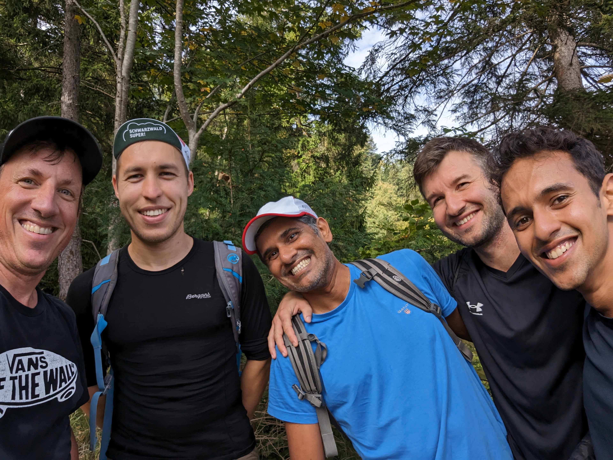

[fore ai's](https://foreai.co) vision centered around "Reliable Artificial Intelligence" is not just a strategic choice; it's a commitment to ensuring the responsible development and deployment of cutting-edge technology. In a landscape where AI applications are becoming increasingly integrated into our daily lives, a commitment to "Reliable Artificial Intelligence" ensures that innovation is coupled with a steadfast dedication to ethical and dependable practices.

We are a team of ex-Google engineers who have worked on quality for apps ranging from Search, Maps, Ads and Shopping, to most recently, Lens: the world’s most used visual AI application. We want to bring the set of tools and practices that we had taken for granted
at Google for use in the wider AI community.

