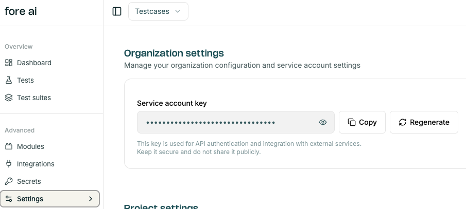

# CI/CD Integration
Test automation works best when integrated with the CI/CD. Tests should be triggered after the new build is pushed to make sure the build works correctly and there are no regressions.
See [CJ GitHub Actions](https://github.com/marketplace/actions/critical-journey) to trigger test suites or individual tests, including examples of YAML files.

You will need to put the `service_account_key`, which you can find in Settings.
 and put it into your GitHub project secrets as `CRITICAL_JOURNEY_SERVICE_ACCOUNT_KEY`.

## Getting notifications

You can get notifications directly from your GitHub Action. It's also possible to send notifications to channels of:
- Google Chat
- MS Teams
- Slack 

by adding a section in your YAML file. Consult your favorite LLM Chat to learn how to set up a Webhook URL to your channels and format the message.
