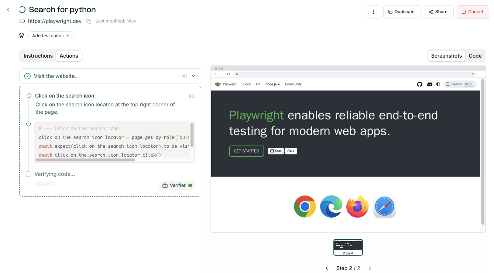
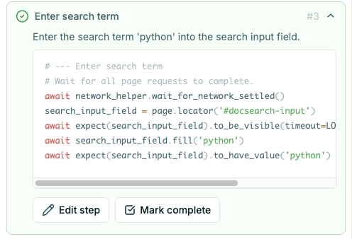
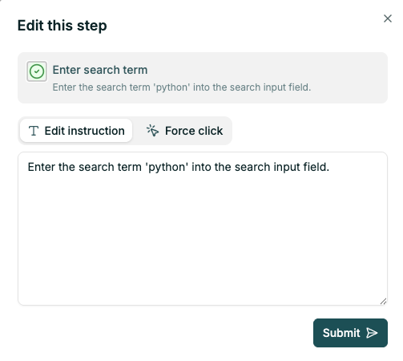
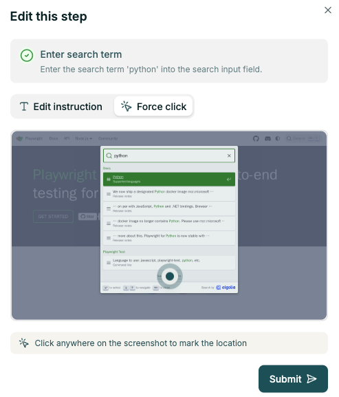

# Generating a test

After entering the test case you can trigger the test generation, which converts the instructions into
code using AI models. The generated code will be used for running the test.

Test steps are generated one-by-one, with the following logic:
- first step is `Visit the webpage`, opening the provided initial website URL
- generate next step title and description
- generate (python/playwright) code for this step
- execute generated code. If there's an error, regenerate the code and execute.
- when the code executes without error, take a screenshot and verify if the screenshot matches the
 expected step outcome
- generate steps until instructions are fulfilled, or cannot be completed (failure).

# Fixing / improving the test

If the generated steps failed or steps/code are not what you expected:

1. Make sure the instructions are correct - first try improving instructions and regenerate.
1. If instructions are correct, but step is not - correct the step title / description and regenerate.
1. If the step is correct, but code is doing a wrong thing (e.g. clicking on the wrong element) - give a coder hint.
1. If step verification failed, but you are happy with what the step did - override the verification result.
1. Some final steps are not necessary - mark the test as complete in one of the earlier steps (`Mark complete` button). Following steps will not be executed.

## Updating the steps in the UI

To update the step:
- expand the step
- click on the `Edit step` button
- modify the step instruction or choose to force click
- submit the result.

This will trigger testcase generation with the updated step.

### Force click
Force click allows you to indicate the element which should be clicked in this step. This is then converted into a stable locator.

## Running tests

See the [Running Tests Guide](./running_analyzing_tests.md).