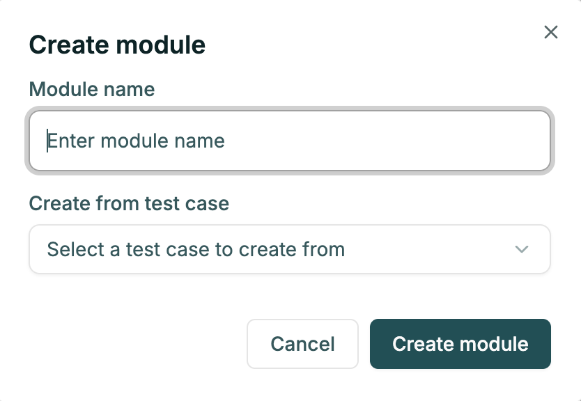

# Modules

[Modules](https://app.foreai.co/modules) allow you to execute code **before** all the testcase steps - mostly used for preparing the
environment or cleaning up before the test.

Module can be created from:
- another testcase
- python script (approved by CJ admin) 

Common usage patterns:
- clean the account data
- inject test data, populate database with data to operate on
- remove any leftovers from previous failed runs
- use your product internal API.

