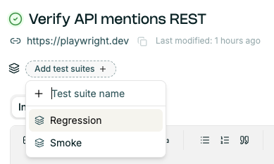
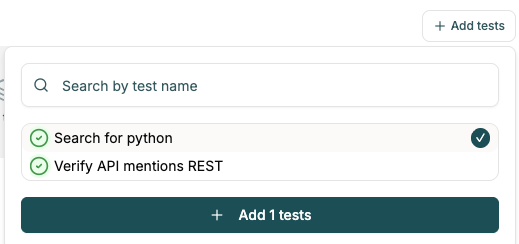

# Organizing tests

There's multiple ways you can organize [tests](https://app.foreai.co/test-cases):
- folder structure
- test suites.

## Folder structure

When creating a new testcase, it's possible to create a new folder. Then you can drag & drop the testcase between folders.

## Test Suites

[Test Suites](https://app.foreai.co/test-cases/collections) allow you to group and execute tests together.

You can add a test case to the test suite:
- in the test **case** details, by clicking on the `(Add test suites) +` button under the title / URL

- in the test **suite** view, by clicking on `+ Add tests`.

