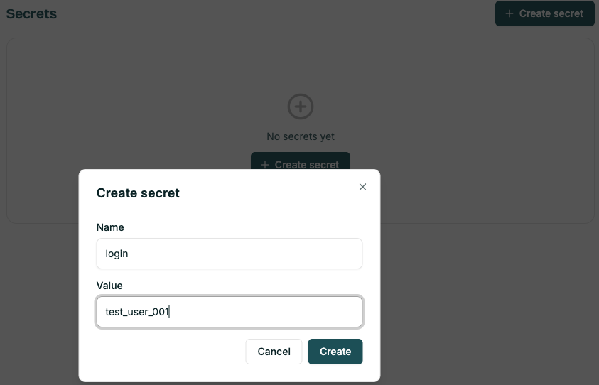
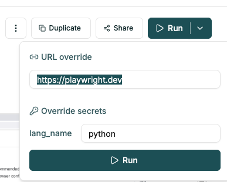

# Test case and project parameters

Test cases can have individual parameters (called 'Variables'), that are visible only for one
testcase, or shared parameters (called `Secrets`), visible for all testcases in the project.

## Secrets

Secrets section in the UI can be used to create and update shared values for tests. Common examples:
- usernames / passwords,
- credit card / payment details.



For all secrets:
- value is masked in the Settings UI and the code,
- you can only copy or update the value.

To use the secrets in a testcase, you need to add them in the test case options - see [Creating tests - Options](./creating_tests.md#options).


To use the parameter value in the testcase instructions, use `@param_name`, like:

```
Login with @username / @password and search for @product_name.
```

### Overriding parameters

It's possible to override the parameter values and URL from the CJ UI and using [CJ GitHub Actions](https://github.com/marketplace/actions/critical-journey).

In the testcase UI, open the dropdown in the `Run` button and override the values.




For [CJ GitHub Actions](https://github.com/marketplace/actions/critical-journey), set `params_override` in the YAML file - see [example running a test suite](https://github.com/marketplace/actions/critical-journey#example-usage-for-running-a-test-suite).