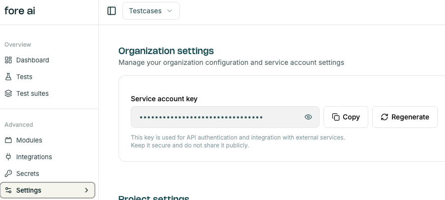

# Project Settings

In the `Settings` tab, you can view and manage general project settings, like:
- project name
- team members

## Organization settings

Copy or regenerate the service API key to use for [CI/CD integration](./ci_cd_integration.md).


## Team

Add / remove team members - click on `+ Invite user` to add new users.


```
