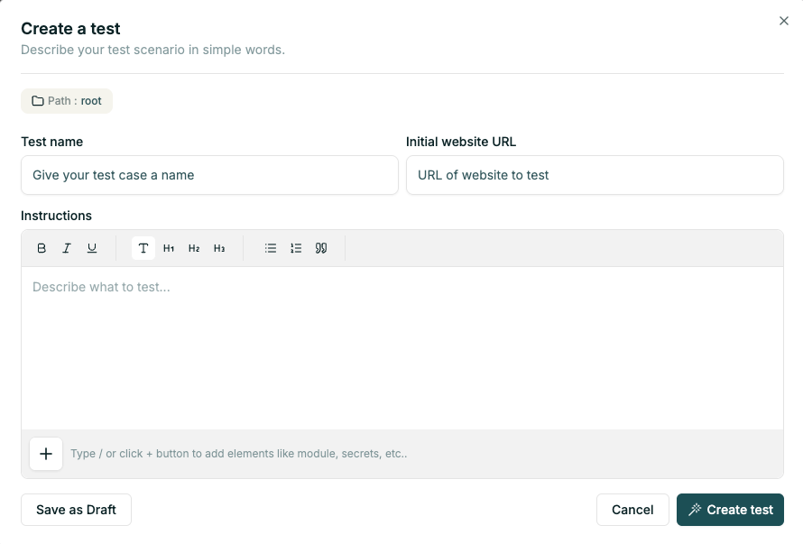

# Quick Start

Getting to an automated testcase in three steps:
1. Login with your account,
1. [Create a test case](./creating_tests.md) by filling in test case name, website address and instructions,
1. Click `Create test` to start and watch [test steps and code generation](./generating_test.md).

