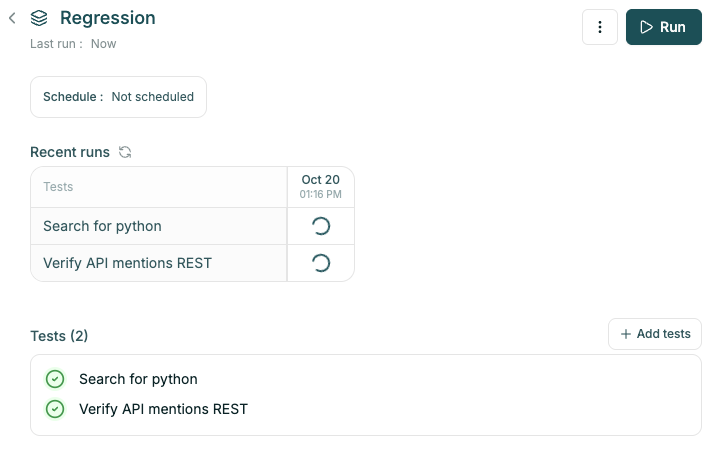
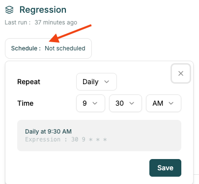
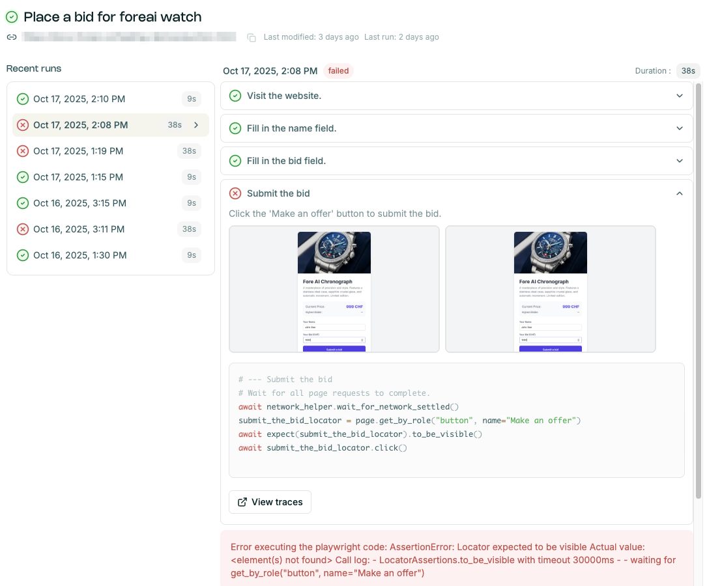

# Running tests and analyzing test runs

Trigger and analyze tests to gain confidence about your product and detect regressions.

NOTE: test runs are executing the previously generated code, there's no AI involved in executing
the code.

## Triggering tests

Test runs can be triggered in multiple ways:
- manually, from the UI
- as an individual test, or part of test suite run
- from [CI/CD](./ci_cd_integration.md), using GitHub Action, both for individual test cases and
test suites.

It's also possible to [override the parameters](./parameters.md#overriding-parameters) like URL, secrets and browser engine.

### Individual tests

Open the individual test and click on the `Run` button. Tests are listed under [Tests] section (https://app.foreai.co/test-cases).

### Test Suites

Test suite runs can be triggered:
- from the UI - open the test suite and click on the `Run` button.

- from CI/CD through GitHub Action - see [CI/CD Integration](./ci_cd_integration.md).

### Scheduling Test Suite runs

Test Suite runs can be scheduled in the test suite details. Click on the `Schedule : ...` button
and define the frequency.

You can also schedule the runs from GitHub - see [CI/CD Integration](./ci_cd_integration.md).

## Analyzing test runs

Test run is available from:
- test details page - click on `Recent runs`
- test suite - click on passed or faild run icon / `View run details` button.

Find all the info in test run details:
- start time
- elapsed time
- executed steps, with screenshots and code
- error message
- playwright traces for advanced debugging.

### Advanced debugging

Open the Playwright traces (`View traces` button on the step) on the test run details. These traces
contain:
- screenshots from the step - hover over the timeline to see the progress
- playwright actions
- console messages (`Console` tab in the bottom menu)
- network messages (`Network` tab in the bottom )

Note: for playwright actions, some data might be obfuscated to avoid leaking sensitive information.